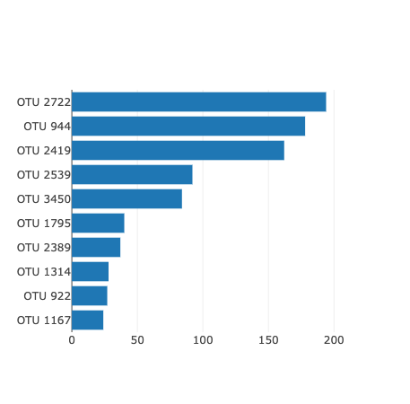

# Belly-Button Biodiversity
This repository constitutes the JS folder containing the data folder(which includes the sample.json file) and the app.js javascript file.The index.html file is 
outside of the JS folder. The Images folder contains the barchart, Panel_selectID,bubblechart ,gaugechart  and the Screenshot of the BellyButtonBiodiversity Dashboard.
The same was also deployed to GitHub pages and the link to that is https://vasudhanair.github.io/Belly-Button-Biodiversity/ .
This is an interactive dashboard that explores the Belly Button Biodiversity dataset which catalogs the microbes that inhabit human navels.
D3 library was employed to read in samples.json file.
A horizontal bar graph was charted to display the top 10 OTUs found in each individual.

Displayed the sample metadata(an individual's demographic information) with dropdown menu

